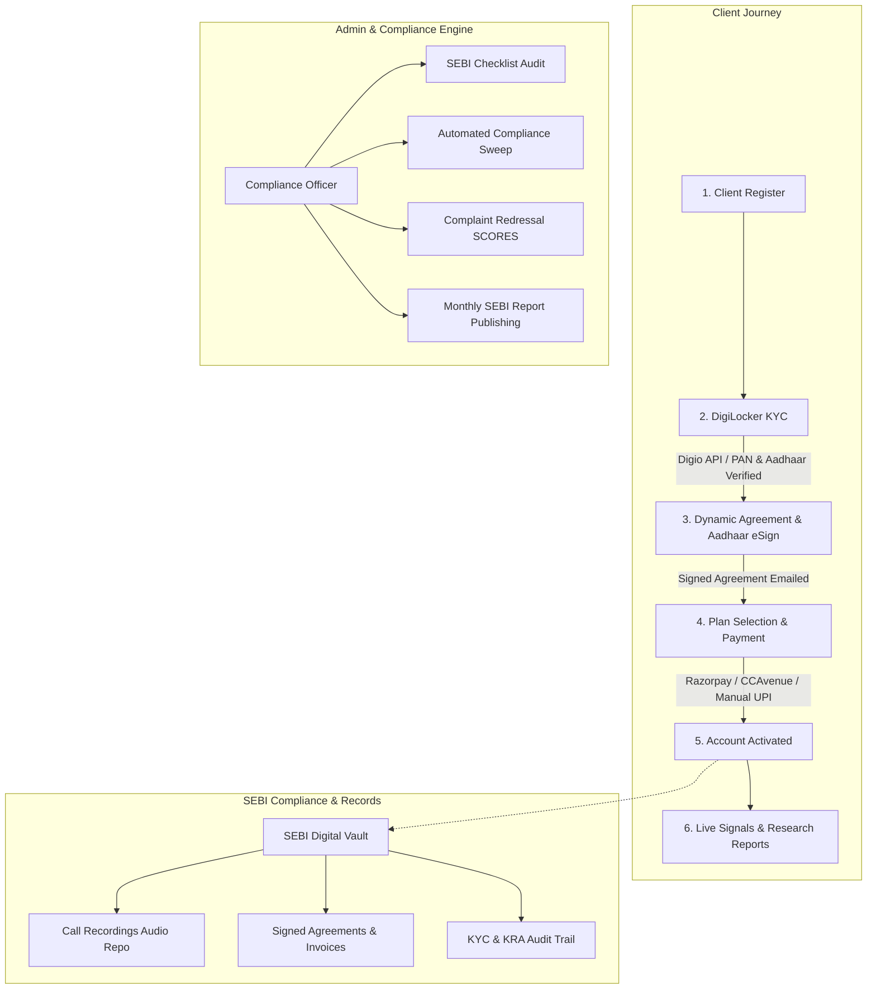

# SEBI Compliance & Research Analyst Platform
## Complete System Flow, Architecture & API Documentation

---

## 📑 Table of Contents
1. [System Architecture & Flow Overview](#1-system-architecture--flow-overview)
2. [End-to-End Client Lifecycle & Onboarding Flow](#2-end-to-end-client-lifecycle--onboarding-flow)
   - [Step 1: Registration & Account Creation](#step-1-registration--account-creation)
   - [Step 2: DigiLocker KYC via Digio](#step-2-digilocker-kyc-via-digio)
   - [Step 3: Dynamic Agreement Generation & Aadhaar eSign](#step-3-dynamic-agreement-generation--aadhaar-esign)
   - [Step 4: Plan Selection & Payment Gateway Integration](#step-4-plan-selection--payment-gateway-integration)
   - [Step 5: Active Services & Advisory Portal](#step-5-active-services--advisory-portal)
3. [MongoDB Collections & Data Storage Mapping](#3-mongodb-collections--data-storage-mapping)
4. [Complete API Directory (Module-Wise)](#4-complete-api-directory-module-wise)
   - [1. Authentication & Security APIs](#1-authentication--security-apis)
   - [2. Client Portal & Onboarding APIs](#2-client-portal--onboarding-apis)
   - [3. Payment & Invoicing APIs](#3-payment--invoicing-apis)
   - [4. Admin Management APIs](#4-admin-management-apis)
   - [5. Client Vault & Audio Recording Compliance APIs](#5-client-vault--audio-recording-compliance-apis)
   - [6. Research, Signals & Stock Recommendations APIs](#6-research-signals--stock-recommendations-apis)
   - [7. SEBI Compliance & Audit Engine APIs](#7-sebi-compliance--audit-engine-apis)
   - [8. Support Tickets & Grievance Complaints APIs](#8-support-tickets--grievance-complaints-apis)
   - [9. Super Admin & Multi-Tenancy Engine APIs](#9-super-admin--multi-tenancy-engine-apis)
   - [10. Data Exports, Settings & File Downloads APIs](#10-data-exports-settings--file-downloads-apis)
5. [Client State Transition Matrix](#5-client-state-transition-matrix)

---

## 1. System Architecture & Flow Overview



---

## 2. End-to-End Client Lifecycle & Onboarding Flow

### Step 1: Registration & Account Creation
* **API:** `POST /api/client/register`
* **Flow:** Client enters name, mobile number, email, and password.
* **Database Updates:**
  - **`User` Collection:** Creates user record with hashed password and role `CLIENT`.
  - **`Client` Collection:** Creates client entity with initial onboarding status `KYC_PENDING`.
  - **`ClientProfile` Collection:** Initializes profile record linked to `clientId`.

---

### Step 2: DigiLocker KYC via Digio
* **Initiate API:** `POST /api/client/kyc/initiate`
  - Backend retrieves tenant's Digio API credentials (`digioClientId`, `digioClientSecret`, `digioKycTemplateName`).
  - Calls Digio KYC service to create a DigiLocker authentication request.
  - Returns Digio KYC ID and redirection URL / SDK token to frontend.
* **Verification & Save API:** `POST /api/client/kyc/status`
  - Digio returns verified identity payload.
  - Backend extracts verified details:
    * `aadhaarName`, `panName`, `pan`, `maskedAadhaar` (e.g. `XXXX-XXXX-1234`)
    * `dob`, `gender`, `fatherName`, `address`, `city`, `state`, `zipCode`
  - **Duplicate Check:** Validates that the PAN number is unique across active clients.
* **Database Updates:**
  - **`Client` Collection:**
    * Saves all verified details & full raw Digio payload in `digilockerData`.
    * Sets `kraVerified = true`, `kycStatus = 'VERIFIED'`.
    * Advances client onboarding status to **`AGREEMENT_PENDING`**.
  - **`ClientProfile` Collection:**
    * Populates verified address, DOB, and names.
    * Sets `isDigiLockerLocked = true` to prevent unverified manual tampering.
  - **`User` Collection:**
    * Synchronizes `firstName` and `lastName` with the official verified name.

---

### Step 3: Dynamic Agreement Generation & Aadhaar eSign
* **Initiate API:** `POST /api/client/agreement/initiate`
  - Backend retrieves client's verified DigiLocker name and masked Aadhaar.
  - Generates a customized, SEBI-compliant **Advisory Agreement PDF** dynamically (`generateAgreementPdf`).
  - Uploads PDF to Digio for Aadhaar eSign.
  - Returns Digio eSign Token to client.
* **Sign Callback API:** `POST /api/client/kyc/status` (with `type: "AGREEMENT"`)
  - Once signed via Aadhaar OTP, Digio verifies the cryptographic certificate.
  - Backend downloads the legally signed PDF via Digio Document API.
  - Stores the signed PDF in `/uploads/agreements/${clientId}_signed_agreement.pdf`.
* **Database Updates:**
  - **`Agreement` Collection:** Creates a record with `esignMode: 'AADHAAR_ESIGN'`, `status: 'SIGNED'`, `signedAt: new Date()`, `agreementUrl`.
  - **`Client` Collection:** Sets `agreementSigned = true` and updates status to **`PAYMENT_PENDING`**.
  - **Email Service:** Automatically dispatches the **Signed Agreement PDF** copy directly to the client's email address.

---

### Step 4: Plan Selection & Payment Gateway Integration
* **Available Plans API:** `GET /api/client/plans`
* **Coupons Apply API:** `POST /api/client/coupons/apply`
* **Payment Gateways Supported:**
  1. **Razorpay Online:**
     - `POST /api/payment/razorpay/initiate` $\rightarrow$ Creates Razorpay Order ID.
     - `POST /api/payment/razorpay/verify` $\rightarrow$ Verifies HMAC signature.
  2. **CCAvenue Online:**
     - `POST /api/payment/ccavenue/initiate` $\rightarrow$ Generates encrypted request string.
     - `POST /api/payment/ccavenue/response` $\rightarrow$ Handles encrypted redirect callback.
  3. **Offline / Manual UPI & Bank Transfer:**
     - `POST /api/client/payments/manual` $\rightarrow$ Client uploads payment receipt / UTR. Status: `PENDING_APPROVAL`.
     - `POST /api/admin/payments/verify` $\rightarrow$ Admin verifies UTR and approves transaction.
* **Database Updates on Success:**
  - **`Payment` Collection:** Creates record with GST breakdown (CGST, SGST, IGST), payment mode, transaction ID, invoice number.
  - **`Subscription` Collection:** Activates advisory subscription with `startDate`, `endDate`, and plan mapping.
  - **`Client` Collection:** Status transitions to **`ACTIVE`**.
  - **Invoice Engine:** Dynamically generates SEBI-compliant **Tax Invoice PDF** and emails it to the client.

---

### Step 5: Active Services & Advisory Portal
* Active clients gain full access to:
  - **Stock Signals:** Recommendations with Target, Stoploss, Timeframe, and rationale.
  - **SEBI Research Reports:** Downloadable detailed research documents.
  - **Client Portal:** Invoices, subscriptions, notifications, and profile settings.
  - **Support Tickets & Grievance Complaints:** Two-way messaging with compliance desk.

---

## 3. MongoDB Collections & Data Storage Mapping

| # | Collection / Model Name | Primary Purpose | Fields & Data Stored |
|---|---|---|---|
| 1 | **`User`** | Authentication & RBAC | `email`, `mobile`, `password`, `role`, `twoFactorSecret`, `is2FAEnabled`, `firstName`, `lastName`, `status` |
| 2 | **`Client`** | Client Core & KYC Entity | `userId`, `tenantId`, `status`, `kycStatus`, `kraVerified`, `agreementSigned`, `pan`, `aadhaar`, `panName`, `aadhaarName`, `dob`, `gender`, `address`, `city`, `state`, `zipCode`, `digilockerData` |
| 3 | **`ClientProfile`** | Extended Client Details | `clientId`, `addressLine1`, `city`, `state`, `zipCode`, `isDigiLockerLocked`, `riskProfile`, `occupation`, `annualIncome` |
| 4 | **`Agreement`** | SEBI Advisory Agreements | `clientId`, `agreementUrl`, `esignMode`, `ipAddress`, `status`, `signedAt`, `version` |
| 5 | **`Payment`** | Transactions & Invoicing | `clientId`, `tenantId`, `planId`, `amount`, `gstAmount`, `cgst`, `sgst`, `igst`, `invoiceNumber`, `invoiceUrl`, `status`, `paymentMode`, `transactionRef`, `receiptUrl` |
| 6 | **`Subscription`** | Advisory Active Subscriptions| `clientId`, `tenantId`, `planId`, `startDate`, `endDate`, `status` (`ACTIVE`, `EXPIRED`, `CANCELLED`) |
| 7 | **`Plan`** | Subscription Plans | `name`, `category`, `price`, `validityDays`, `features`, `status`, `isPopular` |
| 8 | **`PlanCategory`** | Categories of Plans | `name`, `description`, `slug`, `status` |
| 9 | **`Coupon`** | Discount Engine | `code`, `discountType`, `discountValue`, `expiryDate`, `maxUses`, `usedCount`, `status`, `isVisible` |
| 10 | **`Signal`** | Stock Recommendations | `stockName`, `symbol`, `action` (`BUY`/`SELL`), `entryPrice`, `targetPrice`, `stopLoss`, `timeframe`, `status` (`OPEN`/`CLOSED`), `reportUrl` |
| 11 | **`SignalMessage`** | Signal Live Commentary | `signalId`, `message`, `senderId`, `createdAt` |
| 12 | **`ResearchReport`** | SEBI Research Publications | `title`, `symbol`, `targetPrice`, `reportPdfUrl`, `summary`, `status` (`DRAFT`/`PUBLISHED`), `publishedAt` |
| 13 | **`ClientCallRecording`**| 5-Year SEBI Audio Repo | `clientId`, `audioUrl`, `fileName`, `fileSize`, `duration`, `recordedAt`, `notes`, `staffId` |
| 14 | **`ComplianceRequirement`**| SEBI Checklist Templates | `code`, `title`, `frequency`, `category`, `description`, `mandatory` |
| 15 | **`ComplianceAudit`** | Completed Compliance Audits | `requirementId`, `status`, `proofDocumentUrl`, `auditDate`, `complianceOfficerId`, `remarks` |
| 16 | **`ComplianceAuditHistory`**| Historical Audit Trail | `auditId`, `changedBy`, `previousStatus`, `newStatus`, `timestamp` |
| 17 | **`ComplianceAlert`** | Automated Compliance Issues | `severity` (`HIGH`/`MEDIUM`/`LOW`), `title`, `description`, `status` (`OPEN`/`CLOSED`), `resolvedProofUrl` |
| 18 | **`Penalty`** | Regulatory Penalties Tracker | `authority`, `amount`, `reason`, `dateImposed`, `status` (`PENDING`/`RESOLVED`), `proofUrl` |
| 19 | **`Complaint`** | Grievances & SCORES Tracking | `clientId`, `type`, `subject`, `description`, `status` (`PENDING`/`RESOLVED`), `resolutionLetterUrl`, `scoresRefId` |
| 20 | **`ComplaintMonthlyReport`**| SEBI Website Disclosures | `month`, `year`, `pendingBeginning`, `received`, `resolved`, `pendingEnd`, `grandTotal` |
| 21 | **`SupportTicket`** | Client Help Desk | `ticketNumber`, `clientId`, `subject`, `priority`, `status` (`OPEN`/`IN_PROGRESS`/`CLOSED`), `attachment` |
| 22 | **`TicketMessage`** | Ticket Thread History | `ticketId`, `senderId`, `message`, `attachmentUrl`, `timestamp` |
| 23 | **`Tenant`** | Multi-Tenant Organization | `companyName`, `sebiRegistrationNo`, `digioClientId`, `digioClientSecret`, `digioEnvironment`, `razorpayKeyId`, `razorpaySecret`, `ccavenueMerchantId`, `logoUrl`, `signatureUrl`, `status` |
| 24 | **`Staff`** | Employees & Compliance Roles | `userId`, `role` (`PRINCIPAL_OFFICER`, `COMPLIANCE_OFFICER`, `RESEARCHER`), `nismCertificateUrl`, `nismExpiryDate`, `status` |
| 25 | **`AuditLog` / `ActivityLog`**| Security & Audit Trail | `userId`, `action`, `resource`, `ipAddress`, `userAgent`, `metadata`, `timestamp` |

---

## 4. Complete API Directory (Module-Wise)

### 1. Authentication & Security APIs

| HTTP Method | Endpoint | Auth / Role | Description / Payload |
|---|---|---|---|
| `POST` | `/api/auth/login` | Public | Email and password login. Returns JWT and user payload. |
| `POST` | `/api/auth/request-login-otp` | Public | Sends OTP for passwordless login. |
| `POST` | `/api/auth/login-with-otp` | Public | Verifies login OTP and returns JWT. |
| `POST` | `/api/auth/verify-2fa` | Public | Verifies 6-digit TOTP / SMS 2FA code. |
| `POST` | `/api/auth/resend-2fa` | Public | Re-dispatches 2FA code. |
| `GET` | `/api/auth/security-policy` | Public | Fetches 2FA and password complexity requirements. |
| `POST` | `/api/auth/refresh` | Public | Refreshes expired JWT access token. |
| `POST` | `/api/auth/forgot-password` | Public | Sends password reset email / OTP. |
| `POST` | `/api/auth/reset-password` | Public | Sets new password with valid reset token. |
| `GET` | `/api/auth/me` | Authenticated | Fetches currently logged-in user profile, role, and permissions. |
| `POST` | `/api/auth/change-password` | Authenticated | Changes current user's password. |
| `POST` | `/api/auth/logout` | Authenticated | Invalidates session and logs audit event. |

---

### 2. Client Portal & Onboarding APIs

| HTTP Method | Endpoint | Auth / Role | Description / Payload |
|---|---|---|---|
| `POST` | `/api/client/register` | Public | Registers a new client (`name`, `email`, `mobile`, `password`). |
| `POST` | `/api/client/kyc/initiate` | `CLIENT` | Initiates Digio DigiLocker KYC process. |
| `POST` | `/api/client/agreement/initiate` | `CLIENT` | Generates dynamic agreement PDF and starts Digio Aadhaar eSign. |
| `POST` | `/api/client/kyc/status` | `CLIENT` | Receives Digio callback, parses PAN/Aadhaar, saves KYC & signed agreement. |
| `POST` | `/api/client/kyc-agreement/status` | `CLIENT` | Alias endpoint for KYC and eSign status verification. |
| `POST` | `/api/client/kyc/verify` | `CLIENT` | Manual KRA check verification. |
| `POST` | `/api/client/consent` | `CLIENT` | Submits client digital terms consent. |
| `POST` | `/api/client/esign` | `CLIENT` | Fallback agreement digital signature endpoint. |
| `GET` | `/api/client/profile` | `CLIENT` | Returns full client profile (KYC status, address, personal data). |
| `PUT` | `/api/client/profile` | `CLIENT` | Updates allowed non-locked profile details. |
| `DELETE`| `/api/client/account` | `CLIENT` | Client self-account deactivation request. |
| `POST` | `/api/client/documents` | `CLIENT` | Uploads client support ID documents (`multipart/form-data`). |
| `GET` | `/api/client/plans` | `CLIENT` | Returns active advisory subscription plans. |
| `GET` | `/api/client/coupons` | `CLIENT` | Returns list of applicable public coupons. |
| `POST` | `/api/client/coupons/apply` | `CLIENT` | Validates coupon code and calculates discount. |
| `GET` | `/api/client/subscriptions` | `CLIENT` | Returns client's active and expired subscriptions. |
| `GET` | `/api/client/payments` | `CLIENT` | Returns payment transaction history. |
| `GET` | `/api/client/payments/:id/invoice` | `CLIENT` | Downloads dynamic PDF tax invoice. |
| `GET` | `/api/client/notifications` | `CLIENT` | Returns client-specific notifications and alerts. |
| `GET` | `/api/client/market-overview` | Authenticated | Returns live market indices summary. |
| `GET` | `/api/client/news-feed` | Authenticated | Returns real-time market financial news. |

---

### 3. Payment & Invoicing APIs

| HTTP Method | Endpoint | Auth / Role | Description / Payload |
|---|---|---|---|
| `GET` | `/api/payment/gateway-status` | Authenticated | Returns active payment gateways (Razorpay, CCAvenue, Manual). |
| `POST` | `/api/payment/razorpay/initiate` | `CLIENT` | Creates Razorpay order for plan amount. |
| `POST` | `/api/payment/razorpay/verify` | `CLIENT` | Verifies Razorpay payment signature & activates subscription. |
| `POST` | `/api/webhook/razorpay` | Public (Webhook) | Asynchronous webhook handler for Razorpay events. |
| `POST` | `/api/payment/ccavenue/initiate` | `CLIENT` | Initiates CCAvenue encrypted transaction. |
| `POST` | `/api/payment/ccavenue/response` | Public | Handles CCAvenue post-back response. |
| `POST` | `/api/client/payments/manual` | `CLIENT` | Submits offline bank transfer / UPI payment slip. |
| `POST` | `/api/admin/payments/verify` | `ACCESS_PAYMENTS` | Admin approves or rejects manual payment. |
| `GET` | `/api/admin/payments` | `ACCESS_PAYMENTS` | Admin list of all transactions with filters. |

---

### 4. Admin Management APIs

| HTTP Method | Endpoint | Auth / Role | Description / Payload |
|---|---|---|---|
| `GET` | `/api/admin/dashboard-stats` | `ACCESS_DASHBOARD` | Fetches dashboard metrics (revenue, clients, KYC, compliance). |
| `GET` | `/api/admin/profile-completeness` | `ACCESS_DASHBOARD` | Returns tenant compliance & profile setup score. |
| `GET` | `/api/admin/clients` | `ACCESS_CLIENTS` | Paginated list of clients with search and filter. |
| `PUT` | `/api/admin/clients/:id` | `ACCESS_CLIENTS` | Updates client information. |
| `POST` | `/api/admin/clients/:id/status` | `ACCESS_CLIENTS` | Toggles client active / suspended status. |
| `DELETE`| `/api/admin/clients/:id` | `ACCESS_CLIENTS` | Soft-deletes client record. |
| `POST` | `/api/admin/clients/:id/restore` | `ACCESS_CLIENTS` | Restores soft-deleted client. |
| `POST` | `/api/admin/clients/:id/assign-plan` | `ACCESS_CLIENTS` | Manually assigns plan to client. |
| `PUT` | `/api/admin/clients/:id/approve` | `ACCESS_CLIENTS` | Directly approves client account. |
| `POST` | `/api/admin/clients/reset-kyc` | Admin / Staff | Resets client KYC to re-trigger onboarding. |
| `GET` | `/api/admin/clients/:clientId/timeline` | `ACCESS_CLIENTS` | Full audit timeline of client lifecycle. |
| `GET` | `/api/admin/staff` | `ACCESS_STAFF` | List of employees, compliance officers, and researchers. |
| `POST` | `/api/admin/staff` | `ACCESS_STAFF` | Creates new staff member with NISM upload. |
| `PUT` | `/api/admin/staff/:id` | `ACCESS_STAFF` | Updates staff details and roles. |
| `POST` | `/api/admin/staff/:id/status` | `ACCESS_STAFF` | Toggles staff active status. |
| `DELETE`| `/api/admin/staff/:id` | `ACCESS_STAFF` | Deletes staff member. |
| `POST` | `/api/admin/parse-nism-certificate` | `ACCESS_STAFF` | OCR parser for NISM certificates. |
| `GET` | `/api/admin/plans` | `ACCESS_PLANS` | Lists all advisory plans. |
| `POST` | `/api/admin/plans` | `ACCESS_PLANS` | Creates new plan. |
| `PUT` | `/api/admin/plans/:id` | `ACCESS_PLANS` | Modifies existing plan. |
| `DELETE`| `/api/admin/plans/:id` | `ACCESS_PLANS` | Deletes plan. |
| `GET` | `/api/admin/categories` | `ACCESS_PLANS` | Lists plan categories. |
| `POST` | `/api/admin/categories` | `ACCESS_PLANS` | Creates plan category. |
| `GET` | `/api/admin/coupons` | `ACCESS_SETTINGS` | Lists all discount coupons. |
| `POST` | `/api/admin/coupons` | `ACCESS_SETTINGS` | Creates new coupon code. |
| `PUT` | `/api/admin/coupons/:id` | `ACCESS_SETTINGS` | Updates coupon parameters. |

---

### 5. Client Vault & Audio Recording Compliance APIs

| HTTP Method | Endpoint | Auth / Role | Description / Payload |
|---|---|---|---|
| `GET` | `/api/admin/vaults` | `ACCESS_VAULTS` | Lists all client vaults for SEBI 5-year data retention. |
| `GET` | `/api/admin/vaults/:clientId` | `ACCESS_VAULTS` | Returns all recordings, agreements, and invoices for client. |
| `POST` | `/api/admin/vaults/:clientId/recordings` | `ACCESS_VAULTS_FULL`| Uploads call audio recording (`.mp3`, `.wav`, `.m4a`). |
| `DELETE`| `/api/admin/vaults/:clientId/recordings/:id` | `ACCESS_VAULTS_FULL`| Deletes call recording entry. |
| `GET` | `/api/admin/vaults/:clientId/export-zip` | `ACCESS_VAULTS_FULL`| Downloads complete ZIP of client vault. |
| `GET` | `/api/admin/vaults/:clientId/agreement` | `ACCESS_VAULTS_FULL`| Downloads signed advisory agreement. |
| `GET` | `/api/admin/vaults/:clientId/invoice/:payId` | `ACCESS_VAULTS_FULL`| Downloads specific payment invoice PDF. |

---

### 6. Research, Signals & Stock Recommendations APIs

| HTTP Method | Endpoint | Auth / Role | Description / Payload |
|---|---|---|---|
| `GET` | `/api/stocks` | Authenticated | Stock master list search. |
| `GET` | `/api/signals` | Authenticated | Lists published trading/investment signals. |
| `POST` | `/api/signals` | `ACCESS_RESEARCH` | Creates new stock signal with targets and stoploss. |
| `PATCH`| `/api/signals/:id/close` | `ACCESS_RESEARCH` | Closes active signal (target achieved / SL hit). |
| `POST` | `/api/signals/:id/report` | `ACCESS_RESEARCH` | Attaches detailed PDF research report to signal. |
| `POST` | `/api/signals/:id/messages` | `ACCESS_RESEARCH` | Broadcasts live update message on signal. |
| `GET` | `/api/research/list` | Authenticated | Lists research reports. |
| `POST` | `/api/research` | `ACCESS_RESEARCH` | Creates SEBI research publication draft. |
| `PUT` | `/api/research/:id` | `ACCESS_RESEARCH` | Updates research report content. |
| `POST` | `/api/research/:id/publish` | `ACCESS_RESEARCH` | Publishes report to client portal. |
| `GET` | `/api/research/:id/detail` | Authenticated | Fetches full research report content. |

---

### 7. SEBI Compliance & Audit Engine APIs

| HTTP Method | Endpoint | Auth / Role | Description / Payload |
|---|---|---|---|
| `POST` | `/api/compliance/check` | `ACCESS_COMPLIANCE` | Runs automated compliance checks across all clients. |
| `GET` | `/api/compliance/alerts` | `ACCESS_COMPLIANCE` | Lists pending compliance alerts. |
| `POST` | `/api/compliance/alerts/:id/close`| `ACCESS_COMPLIANCE` | Resolves compliance alert with proof upload. |
| `GET` | `/api/compliance/checklist` | `ACCESS_COMPLIANCE` | Fetches mandatory SEBI checklist items. |
| `POST` | `/api/compliance/checklist/:reqId`| `ACCESS_COMPLIANCE` | Submits audit verification and proof document. |
| `GET` | `/api/compliance/checklist/history`| `ACCESS_COMPLIANCE` | Historical log of checklist verifications. |
| `GET` | `/api/compliance/penalties` | `ACCESS_COMPLIANCE` | Lists regulatory penalties & resolutions. |
| `POST` | `/api/compliance/penalties/:id/resolve`| `ACCESS_COMPLIANCE` | Marks penalty as resolved with proof document. |
| `GET` | `/api/compliance/dashboard-metrics`| `ACCESS_COMPLIANCE`| Returns compliance health score. |
| `GET` | `/api/compliance/periodic-report-data`| `ACCESS_COMPLIANCE`| Aggregates periodic SEBI inspection reports. |

---

### 8. Support Tickets & Grievance Complaints APIs

| HTTP Method | Endpoint | Auth / Role | Description / Payload |
|---|---|---|---|
| `POST` | `/api/client/tickets` | `CLIENT` | Opens support ticket with attachment. |
| `GET` | `/api/client/tickets` | `CLIENT` | Returns client's tickets list. |
| `GET` | `/api/client/tickets/:id` | `CLIENT` | Returns ticket details and message thread. |
| `POST` | `/api/client/tickets/:id/reply` | `CLIENT` | Sends message reply to ticket. |
| `GET` | `/api/admin/tickets` | Admin / Staff | Lists all tickets across clients. |
| `POST` | `/api/admin/tickets/:id/reply` | Admin / Staff | Admin reply to ticket. |
| `POST` | `/api/admin/tickets/:id/close` | Admin / Staff | Closes support ticket. |
| `POST` | `/api/client/complaints` | `CLIENT` | Lodges formal SEBI grievance complaint. |
| `GET` | `/api/compliance/complaints` | `ACCESS_COMPLIANCE` | Returns complaints log. |
| `PUT` | `/api/compliance/complaints/:id/resolve`| `ACCESS_COMPLIANCE` | Resolves complaint with official resolution letter. |
| `POST` | `/api/admin/complaint-report` | `ADMIN` | Updates SEBI monthly website complaint table. |
| `GET` | `/api/complaint-report` | Public | Public website disclosure of grievance data. |

---

### 9. Super Admin & Multi-Tenancy Engine APIs

| HTTP Method | Endpoint | Auth / Role | Description / Payload |
|---|---|---|---|
| `GET` | `/api/super-admin/tenants` | `SUPER_ADMIN` | Lists all onboarded Research Analyst companies. |
| `POST` | `/api/super-admin/tenants` | `SUPER_ADMIN` | Provisions new Research Analyst tenant company. |
| `PUT` | `/api/super-admin/tenants/:id` | `SUPER_ADMIN` | Updates company details and certificates. |
| `POST` | `/api/super-admin/tenants/:id/status` | `SUPER_ADMIN` | Suspends or activates company account. |
| `POST` | `/api/super-admin/tenants/:id/provision-db`| `SUPER_ADMIN` | Provisions isolated tenant database connection. |
| `POST` | `/api/super-admin/tenants/:id/impersonate`| `SUPER_ADMIN` | Generates token to log in as tenant admin. |
| `POST` | `/api/super-admin/parse-sebi-certificate` | `SUPER_ADMIN` | OCR parser for SEBI registration certificate. |
| `GET` | `/api/super-admin/telemetry` | `SUPER_ADMIN` | Global system telemetry and active users metrics. |
| `PUT` | `/api/system-settings/branding` | `SUPER_ADMIN` | Updates platform white-label logos and favicon. |

---

### 10. Data Exports, Settings & File Downloads APIs

| HTTP Method | Endpoint | Auth / Role | Description / Payload |
|---|---|---|---|
| `GET` | `/api/admin/exports/clients` | `EXPORT_DATA` | Exports full client database as CSV. |
| `GET` | `/api/admin/exports/payments` | `EXPORT_DATA` | Exports all payment transactions as CSV. |
| `GET` | `/api/admin/exports/agreements`| `EXPORT_DATA` | Exports signed agreements in a ZIP archive. |
| `GET` | `/api/admin/exports/invoices` | `EXPORT_DATA` | Exports all invoice PDFs in a ZIP archive. |
| `GET` | `/api/admin/exports/kra` | `EXPORT_DATA` | Exports KRA verification data in ZIP. |
| `PUT` | `/api/admin/settings` | `ACCESS_SETTINGS` | Updates company SEBI registration, Digio, & gateway keys. |
| `PUT` | `/api/admin/signature` | Admin / Researcher | Uploads authorized signature PNG. |
| `POST` | `/api/admin/test-digio` | `ACCESS_SETTINGS` | Tests Digio KYC and eSign API credentials. |
| `POST` | `/api/admin/test-smtp` | `ADMIN` | Tests SMTP mail server configuration. |
| `GET` | `/api/download` | Public / Secure | Unified download controller for PDFs, recordings, & documents. |

---

## 5. Client State Transition Matrix

```
[ Unregistered User ]
         │
         ▼  (POST /api/client/register)
┌──────────────────────┐
│  Status: KYC_PENDING │
└──────────┬───────────┘
           │
           ▼  (POST /api/client/kyc/status - Digio DigiLocker Success)
┌────────────────────────────┐
│ Status: AGREEMENT_PENDING  │ ──► [ClientProfile & Personal Data Locked]
└──────────┬─────────────────┘
           │
           ▼  (POST /api/client/kyc/status - Digio Aadhaar eSign Success)
┌────────────────────────────┐
│  Status: PAYMENT_PENDING   │ ──► [Signed Agreement PDF Emailed]
└──────────┬─────────────────┘
           │
           ▼  (Payment Success: Razorpay / CCAvenue / Manual Approval)
┌────────────────────────────┐
│       Status: ACTIVE       │ ──► [Full Portal & Signals Access]
└──────────┬─────────────────┘
           │
           ▼  (Subscription Expiration Date)
┌────────────────────────────┐
│      Status: EXPIRED       │
└────────────────────────────┘
```

---
*Documentation generated for SEBI Multi-Tenant Research Analyst Compliance System.*
